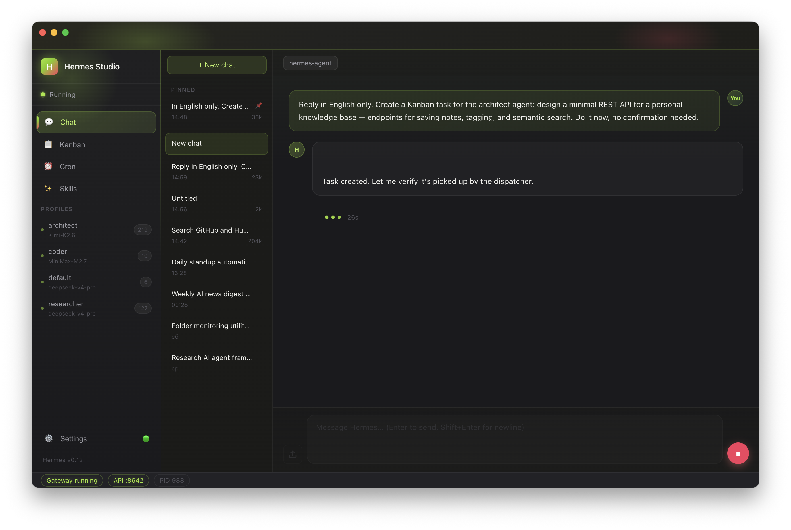
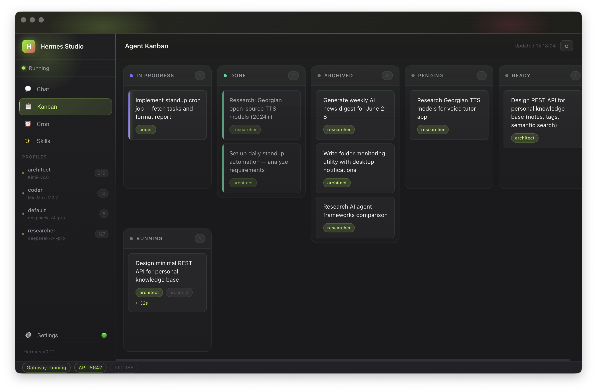

<div align="center">

<!-- TODO: Replace with your banner image -->
<!--  -->

# Hermes Studio

### A native macOS desktop app for [Hermes](https://github.com/nikvdp/hermes) AI agents

Hermes is powerful. But it lives in the terminal.
**Hermes Studio** gives it a proper home — streaming chat, a live agent Kanban board, cron jobs, and three themes. No terminal needed.

<br/>


<br/>

<!-- TODO: Add main screenshot here -->
<!--  -->

</div>

---

## Overview

If you run Hermes agents, you know the drill — terminal windows, log scrolling, no visibility into what's actually happening across your agents. Hermes Studio solves this.

It connects directly to the Hermes runtime on your machine and gives you:
- A real chat interface with streaming, file attachments, and the ability to stop the agent mid-run
- A live Kanban board that shows what every agent is doing right now
- Full session history that doesn't disappear when you switch tabs
- Three carefully designed themes

Everything reads directly from Hermes's SQLite databases and API — no sync, no cloud, no middleman.

---

## Screenshots

<!-- TODO: Add screenshots -->
<!-- 



-->

*Screenshots coming soon — video demo in progress.*

---

## Features

### 💬 Chat
A proper chat interface for your Hermes agents with everything you'd expect.

- **Live streaming** with real-time tool-progress indicators (you see what the agent is doing, step by step)
- **Stop button** — red button to interrupt the agent the moment it starts going off-track
- **File & image attachments** — attach screenshots, documents, code files directly in the chat
- **Pinned sessions** — pin important chats to the top of the sidebar
- **Last-active indicator** — green dot marks the chat where the agent last responded
- **Auto-named sessions** — new chats are titled from your first message, not "Untitled"
- **Tab-safe history** — switching to Kanban and back doesn't wipe your chat

### 📋 Kanban
A visual board that shows exactly what your agents are working on.

- Pulls live from Hermes's `kanban.db` — no polling lag
- Shows task status, assignee profile, run duration, and live activity indicator
- Archived tasks visible for reference (last 5 per board)
- One-click refresh

### ⏰ Cron
Browse and manage all scheduled agent jobs without touching a config file.

- Enable / disable jobs
- Trigger any job manually on demand
- Human-readable schedule display

### 📚 Skills
Browse every installed Hermes skill in a visual card grid — name, description, category, version, tags. At a glance.

### ⚙️ Settings
- **Three themes:** Dark, Light, Lime — switch instantly, no restart
- Theme preference saved between sessions

---

## Requirements

- **macOS** — Apple Silicon (M1 / M2 / M3 / M4)
- **macOS 13 Ventura** or later
- **[Hermes](https://github.com/nikvdp/hermes)** installed and accessible in your PATH

> Hermes Studio auto-launches Hermes on startup and waits until the API is ready. You don't need to manage it manually.

---

## Install

### Download (recommended)

Download the latest `Hermes Studio-x.x.x-arm64.dmg` from [Releases](../../releases), open it, drag to Applications.

### Build from source

```bash
git clone https://github.com/YOUR_USERNAME/hermes-studio.git
cd hermes-studio
npm install
npm run build
cp -R "dist/mac-arm64/Hermes Studio.app" /Applications/
```

**Development mode** (hot reload):
```bash
npm run dev
```

---

## First Launch

On first launch, Hermes Studio will:
1. Auto-start Hermes if it's not already running
2. Check if the API server is enabled
3. If not — show a setup banner with a one-click fix

To enable the API server manually, add to `~/.hermes/.env`:
```
API_SERVER_ENABLED=true
API_SERVER_PORT=8642
```

---

## Agent Profiles

Hermes Studio works with Hermes's standard profile system at `~/.hermes/profiles/`. Each profile is a YAML file that defines which model and tools an agent gets.

A multi-agent setup that works well:

**`default`** — Orchestrator. Receives requests, delegates to specialists, manages Kanban:
```yaml
toolsets:
  - kanban
agent:
  reasoning_effort: high
```

**`architect`** — Builds, writes, codes. Needs file access and terminal:
```yaml
toolsets:
  - web
  - browser
  - file
  - terminal
  - memory
  - skills
agent:
  max_turns: 40
```

**`researcher`** — Deep research with real-time web access:
```yaml
toolsets:
  - web
  - browser
  - file
  - memory
agent:
  max_turns: 40
  reasoning_effort: max
  system_prompt: |
    Always run `date` in terminal first to confirm today's real date.
    Never assume dates from training data.
```

> **Tip:** Without `toolsets: [kanban]` in the orchestrator profile, the agent won't see Kanban tools and will try to search the internet for how to create tasks. Always set it explicitly.

---

## Themes

| | Theme | Accent | Feel |
|--|-------|--------|------|
| 🌑 | **Dark** | Purple / blue | Deep space, focused |
| ☀️ | **Light** | Purple | Clean, minimal |
| 🟢 | **Lime** | Lime green | High contrast, energetic |

All colors are CSS custom properties — adding a new theme is a single `[data-theme="name"]` block in `globals.css`.

---

<details>
<summary><strong>For Developers — Hermes API Quirks</strong></summary>

Real behavioral differences in Hermes that required workarounds. Documented here for anyone building another Hermes client.

### 1. Cron `schedule` is an object, not a string
`GET /api/jobs` returns schedule as:
```json
{ "kind": "cron", "expr": "0 9 * * *", "display": "Every day at 9am" }
```
Rendering it directly crashes React (error #31). **Fix:** extract `display → expr → JSON.stringify`.

### 2. Custom SSE event types
Hermes emits `event: hermes.tool.progress` alongside standard chunks. Standard parsers ignore the `event:` line. **Fix:** track `currentEvent` manually in the SSE loop.

### 3. Session ID in headers causes empty responses
`X-Hermes-Session-Id` causes Hermes to load DB history AND receive it again in the body — duplicate context produces empty responses. **Fix:** never send this header. Pass full history in the request body every time.

### 4. Fake session IDs cause multi-minute delays
A random client-side ID triggers a DB lookup that blocks for several minutes. **Fix:** never send IDs not received directly from the Hermes API.

### 5. API sessions don't get auto-titled
REST API sessions (`api-xxxxxxxx`) never receive generated titles — only CLI sessions do. **Fix:** save the first user message as a local title in `localStorage`.

### 6. Profile symlinks duplicate sidebar entries
`~/.hermes/profiles/` may contain migration symlinks. `readdirSync` follows them. **Fix:** filter with `lstatSync().isSymbolicLink()`.

### 7. SQLite binary path in packaged app
When launched from Launchpad/Finder, PATH may not include Homebrew. **Fix:** resolve `sqlite3` explicitly — `/usr/bin/sqlite3` first, Homebrew as fallback.

</details>

<details>
<summary><strong>Project Structure</strong></summary>

```
src/
├── main/
│   ├── index.ts        # IPC handlers, Hermes process mgmt, SQLite queries
│   └── preload.ts      # contextBridge — exposes window.hermes to renderer
└── renderer/
    ├── App.tsx         # Root: routing, launch overlay, error boundary
    ├── pages/
    │   ├── ChatPage.tsx      # Chat, SSE streaming, attachments, sessions
    │   ├── KanbanPage.tsx    # Task board
    │   ├── CronPage.tsx      # Cron CRUD
    │   ├── SkillsPage.tsx    # Skills grid
    │   └── SettingsPage.tsx
    ├── components/
    │   ├── Sidebar.tsx
    │   ├── StatusBar.tsx
    │   ├── SetupBanner.tsx   # API server enable flow
    │   └── LaunchOverlay.tsx
    ├── hooks/
    │   └── useSession.ts     # Sessions polling + push refresh
    └── styles/
        └── globals.css       # CSS custom properties + all three themes
resources/
└── icon.icns
```

</details>

---

## Contributing

Issues and PRs are welcome.
Please test UI changes across all three themes before submitting.

---

## License

MIT
